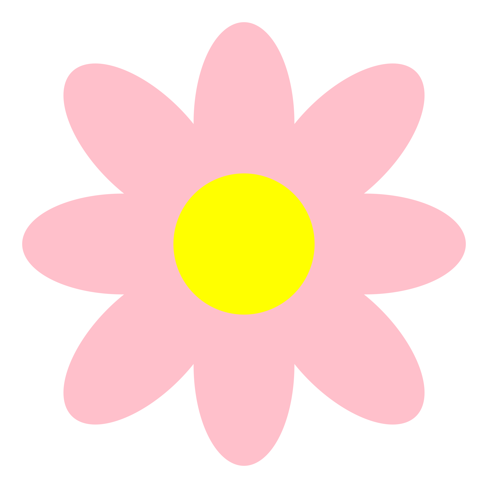
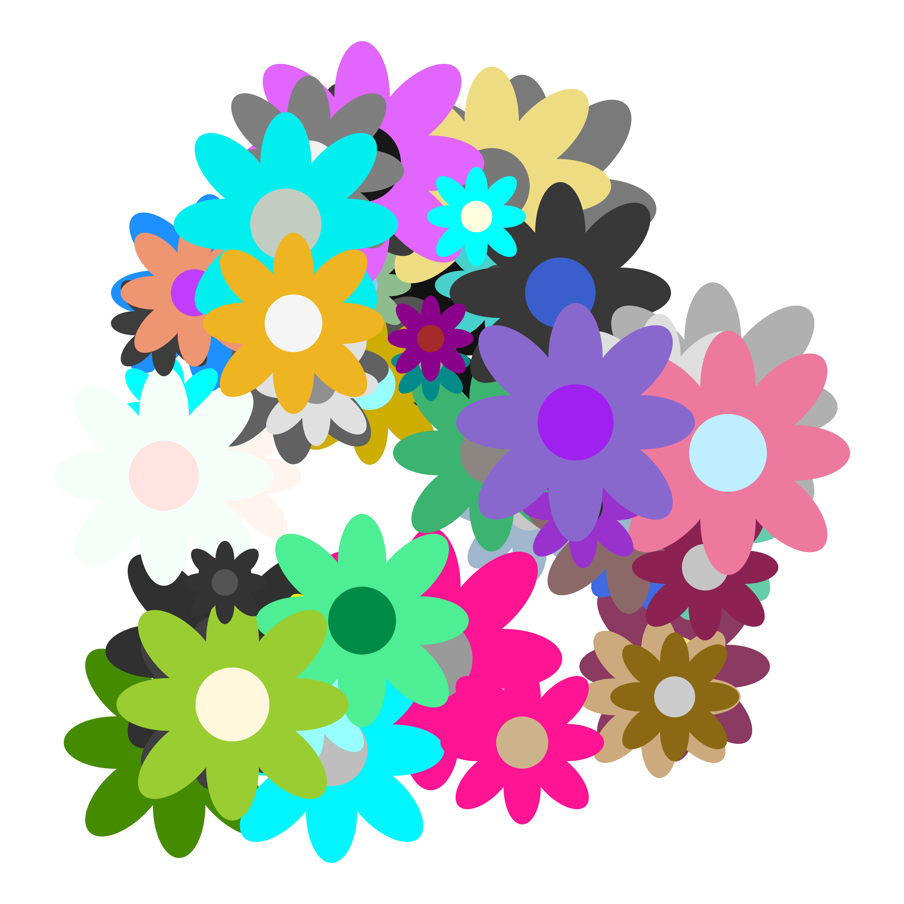

# ggflowers

Functions to make flowers with `ggplot2`

## Examples

Create one daisy:

```
library(ggplot2)

ggplot() +
  geom_daisy() +
  coord_fixed() +
  ggpubr::theme_transparent() +
  theme_void()
  

```


Or many:

```{r}

library(ggplot2)

# number of flowers
n <- 50

set.seed(10)

flower_range <- tibble(
  x = sample(seq(0, 1, 0.25), n),
  y = sample(seq(0, 1, 0.25), n, replace = TRUE),
  petals = sample(colors(), n, replace = TRUE),
  centers = sample(colors(), n, replace = TRUE),
  scale = sample(seq(.5, 1, 0.01), n, replace = TRUE)
)

ggplot() + # flower
  purrr::pmap(
    list(
      flower_range$x,
      flower_range$y,
      flower_range$petals,
      flower_range$centers,
      flower_range$scale
    ),
    geom_daisy
  ) +
  coord_fixed() +
  ggpubr::theme_transparent() +
  theme_void()

```

